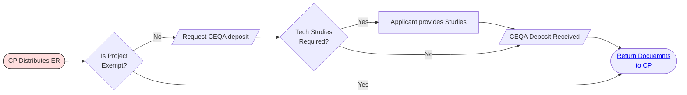
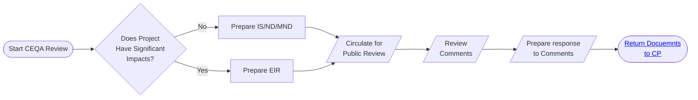
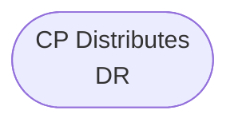
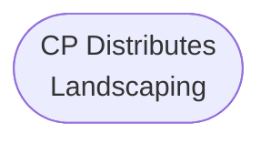
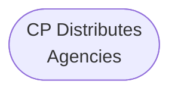

# Process: Current Planner Distributes for Comments

The **"Current Planner Distributes for Comments"** process is a critical step in the project approval workflow, where the Current Planner (CP) coordinates with various stakeholders to gather necessary feedback and ensure that all regulatory and procedural requirements are met. This step ensures that the project complies with relevant laws, regulations, and local ordinances before moving forward.

---

### Process: CP Distributes ER

#### Step-by-Step Breakdown:

1.  **CP Distributes ER (Environmental Review):**
    
    *   The Current Planner begins by distributing the Environmental Review (ER) document to various internal and external agencies, departments, and stakeholders who need to provide input on the project.
        
    *   The distribution of the ER is necessary to collect feedback on any potential environmental impacts associated with the project.
        
2.  **Is Project Exempt? (Decision Point):**
    
    *   The next step involves determining whether the project is exempt from further environmental review under the California Environmental Quality Act (CEQA) or other applicable regulations.
        
    *   **If Yes (Exempt):**
        
        *   The project is deemed exempt from additional environmental scrutiny, and the documents are returned to the Current Planner to continue with the next steps in the process.
            
    *   **If No (Not Exempt):**
        
        *   If the project is not exempt, it must undergo a more detailed environmental review process.
            
3.  **Request CEQA Deposit:**
    
    *   If the project is not exempt, a CEQA (California Environmental Quality Act) deposit is requested from the applicant. This deposit is used to cover the costs associated with conducting the necessary environmental studies and reviews.
        
4.  **Tech Studies Required? (Decision Point):**
    
    *   At this stage, the Current Planner assesses whether technical studies are required to evaluate the project's potential impacts.
        
    *   **If Yes (Required):**
        
        *   The applicant is informed that additional technical studies (such as traffic studies, noise studies, biological assessments, etc.) are necessary.
            
        *   The applicant is then responsible for providing these studies to the reviewing authorities.
            
    *   **If No (Not Required):**
        
        *   If no additional technical studies are required, the process moves forward without this step.
            
5.  **Applicant Provides Studies:**
    
    *   If technical studies are required, the applicant is responsible for commissioning and providing the necessary studies to the Current Planner.
        
    *   These studies are submitted as part of the application package for further review.
        
6.  **CEQA Deposit Received:**
    
    *   Confirmation that the CEQA deposit has been received. This ensures that funds are available to cover the costs of environmental review.
        
7.  **Return Documents to CP:**
    
    *   After the required studies are completed and the CEQA deposit is received, the documents, including any feedback and findings from the environmental review process, are returned to the Current Planner.
        
    *   The Current Planner then uses this information to determine whether the project can proceed to the next steps.
        

#### Purpose and Importance:

*   The **Current Planner Distributes for Comments** process is essential to ensure that the project complies with all environmental regulations and addresses potential concerns from stakeholders and regulatory bodies.
    
*   This process provides a structured approach to identifying and mitigating potential project impacts, ensuring a thorough review before any decision is made on project approval.
    
*   It helps manage risk by identifying issues early in the process, reducing the likelihood of delays or legal challenges later.
    

#### Outcome:

*   The successful completion of this process results in either the project moving forward in the review process or being delayed/modified to address identified concerns. If the project is not exempt and requires further studies, it ensures all necessary documentation and analysis are completed before making any significant decisions.

---

### Process: Start CEQA Review

The **"Start CEQA Review"** process is an integral part of the project evaluation and approval workflow, mandated by the California Environmental Quality Act (CEQA). This process involves a thorough assessment of the environmental impacts of a proposed project to ensure compliance with CEQA requirements. The objective is to identify and mitigate potential adverse effects on the environment before a project proceeds.

#### Step-by-Step Breakdown:

1.  **Start CEQA Review:**
    
    *   The CEQA review begins when it is determined that a proposed project is not exempt from environmental review requirements under CEQA. This can be triggered after the "Current Planner Distributes for Comments" process or at any point when a project requires a detailed environmental assessment.
        
    *   The responsible agency (often the lead agency overseeing the project) initiates the CEQA review process.
        
2.  **Does Project Have Significant Impacts? (Decision Point):**
    
    *   The first decision point in the CEQA review is to assess whether the project is likely to have significant environmental impacts.
        
    *   **If No (No Significant Impacts):**
        
        *   If it is determined that the project does not have significant environmental impacts, the process moves towards preparing either an **Initial Study (IS)**, **Negative Declaration (ND)**, or **Mitigated Negative Declaration (MND)**.
            
    *   **If Yes (Significant Impacts):**
        
        *   If the project is likely to have significant impacts, a more comprehensive review is required, leading to the preparation of an **Environmental Impact Report (EIR)**.
            
3.  **Prepare IS/ND/MND (Initial Study/Negative Declaration/Mitigated Negative Declaration):**
    
    *   If there are no significant environmental impacts, the responsible agency prepares:
        
        *   **Initial Study (IS):** A preliminary analysis to determine whether a Negative Declaration or an Environmental Impact Report is required.
            
        *   **Negative Declaration (ND):** A statement indicating that the project will not have a significant impact on the environment.
            
        *   **Mitigated Negative Declaration (MND):** A declaration indicating that any significant impacts can be mitigated to a less-than-significant level.
            
4.  **Prepare EIR (Environmental Impact Report):**
    
    *   If the project has potential significant environmental impacts, an **Environmental Impact Report (EIR)** is prepared.
        
    *   The EIR is a detailed analysis that evaluates the project's potential environmental effects, discusses ways to mitigate those effects, and considers project alternatives.
        
5.  **Circulate for Public Review:**
    
    *   Both the IS/ND/MND and the EIR are circulated for public review. This step involves notifying the public, interested parties, and regulatory agencies about the project and providing an opportunity to review and comment on the environmental documents.
        
    *   Public review is an essential component of CEQA, ensuring transparency and allowing for public input in the decision-making process.
        
6.  **Comments Reviewed? (Decision Point):**
    
    *   After the public review period, the responsible agency assesses whether all comments and feedback on the environmental documents have been reviewed and adequately addressed.
        
    *   **If No (Comments Not Reviewed):**
        
        *   If comments have not been fully reviewed, the process loops back to ensure that all input is considered.
            
    *   **If Yes (Comments Reviewed):**
        
        *   If all comments have been reviewed, the process moves forward.
            
7.  **Prepare Response to Comments:**
    
    *   The agency prepares detailed responses to all comments received during the public review period. This may involve clarifying information, making revisions to the environmental documents, or proposing additional mitigation measures.
        
8.  **Return Documents to CP (Current Planner):**
    
    *   Once all comments have been addressed, and the necessary revisions are made, the final documents are returned to the Current Planner (CP) to proceed with the next steps in the project approval process.
        

#### Purpose and Importance:

*   The **Start CEQA Review** process ensures that all potential environmental impacts of a project are thoroughly evaluated and documented before any decisions are made.
    
*   It involves public participation and inter-agency coordination to ensure that all concerns are addressed, and the project complies with state environmental laws.
    
*   The process promotes sustainable development by requiring mitigation for any significant environmental impacts and considering alternatives that may reduce adverse effects.
    

#### Outcome:

*   The outcome of the **Start CEQA Review** process is a comprehensive set of environmental documents (IS/ND/MND or EIR) that outlines the project's potential impacts, mitigation measures, and alternatives.
    
*   The successful completion of this process allows the project to proceed with a clear understanding of its environmental implications, reducing the risk of legal challenges and ensuring compliance with CEQA.

---

---

---

