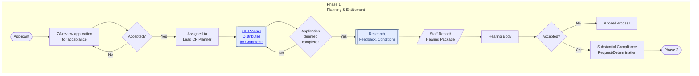

# Flowchart for PER Phase 1: Planning and Entitlement

The **PER Phase 1: Planning and Entitlement** process is the initial phase in the Permit Entitlement Review (PER) workflow. It focuses on evaluating a project's planning and entitlement requirements to ensure compliance with local regulations, environmental standards, and other applicable laws. This phase aims to review and approve a project before it can proceed to subsequent stages, such as permitting and construction.

#### Process Flowchart Breakdown

1.  **Pre-Application Meeting:**
    
    *   The process begins with a **Pre-Application Meeting** between the applicant and the relevant planning department. This meeting aims to discuss the proposed project and provide the applicant with preliminary feedback regarding zoning, land use, and any potential issues that might arise during the application process.
        
2.  **Applicant Submits Application:**
    
    *   After the pre-application meeting, the **Applicant** submits a formal application for the project. This application typically includes project details, site plans, environmental studies, and other necessary documentation.
        
3.  **ZA Review Application for Acceptance:**
    
    *   The Zoning Administrator (ZA) reviews the submitted application to determine if it meets all initial requirements for acceptance. This step ensures that the application is complete and ready for further evaluation.
        
    *   **Decision Point: Accepted?**
        
        *   If the application is not accepted, it is sent back to the applicant for revisions, and the process repeats until it is acceptable.
            
        *   If accepted, the process moves forward.
            
4.  **Assigned to Lead CP Planner:**
    
    *   Once accepted, the application is assigned to a **Lead Current Planner (CP)** responsible for overseeing the detailed review and comment distribution process.
        
5.  **CP Planner Distributes for Comments:**
    
    *   The Lead CP Planner distributes the application package to various internal and external stakeholders, including other planning departments, agencies, and regulatory bodies. This step ensures that all relevant parties have the opportunity to provide feedback and identify any issues or requirements that must be addressed.
        
6.  **Application Deemed Complete? (Decision Point):**
    
    *   After distributing for comments, the Lead CP Planner determines if the application is complete based on the feedback and required studies.
        
    *   **If No:**
        
        *   If the application is incomplete, it is sent back to the applicant or relevant departments for additional information or corrections.
            
    *   **If Yes:**
        
        *   If deemed complete, the application moves to the next stage.
            
7.  **Research, Feedback, and Conditions:**
    
    *   At this point, detailed **Research** is conducted to gather additional data or studies that may be required. Feedback and conditions from all reviewing agencies and stakeholders are consolidated into a final set of requirements that the applicant must meet.
        
8.  **Staff Report/Hearing Package Preparation:**
    
    *   A **Staff Report** and **Hearing Package** are prepared, summarizing all findings, feedback, and recommendations. This report includes all conditions that the applicant must comply with for the project to proceed.
        
9.  **Hearing Body Review:**
    
    *   The application, along with the staff report and hearing package, is presented to the **Hearing Body** (such as a Planning Commission or Board of Supervisors) for review. The hearing body evaluates the project, considers public comments, and makes a decision.
        
    *   **Decision Point: Accepted?**
        
        *   If not accepted, the project may go through an **Appeal Process** or be sent back for modifications.
            
        *   If accepted, it moves to the next step.
            
10.  **Appeal Process (If Required):**
    
        * If the project is not accepted by the Hearing Body, the applicant may choose to enter an **Appeal Process** to contest the decision or address any issues raised.
        
1.   **Substantial Compliance Request/Determination:**
    
        * If the project is accepted, the applicant may need to submit a **Substantial Compliance Request** or **Determination** to demonstrate that all conditions and requirements have been met.
        
1.   **Phase 2: Next Steps:**
    
        * Upon meeting all conditions and receiving the necessary approvals, the project moves to **Phase 2**, which typically involves detailed design review, permit issuance, and construction oversight.