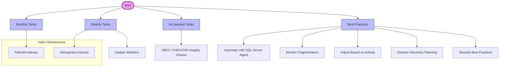

# SQL Server Administration: Best Practices for Optimal Database Performance

### A Comprehensive Guide to Index Maintenance, Integrity Checks, and Performance Monitoring

*This document provides an in-depth exploration of essential SQL Server administration tasks, focusing on maintaining and enhancing database performance, reliability, and integrity. Designed for database administrators and IT professionals, it serves as a foundational guide to best practices in index maintenance, data integrity checks, and effective performance monitoring.*

# Executive Summary
This white paper outlines essential maintenance and monitoring tasks for SQL Server administrators to ensure optimal performance, integrity, and availability of databases. It provides guidelines on the frequency and execution of critical tasks, including database integrity checks, index maintenance, statistics updates, and backup strategies, tailored to different operational environments and business requirements.

## Introduction

#### Background
The foundation of robust database management lies in diligent maintenance and proactive monitoring. In the realm of database administration, particularly with SQL Server, the significance of these tasks cannot be overstated. Regular maintenance ensures that databases run efficiently, remain secure, and are resilient to failures, while proactive monitoring allows administrators to identify and mitigate potential issues before they escalate into critical problems. This systematic approach to database care not only enhances performance but also ensures data integrity and availability, which are paramount in today's data-driven environments.

#### Purpose
The primary aim of this document is to consolidate and articulate a comprehensive set of best practices for SQL Server administration tasks. By adhering to these guidelines, database administrators (DBAs) can optimize database performance, ensure data security, and maintain high availability. These practices have been curated to provide DBAs with actionable strategies that can be implemented to manage SQL Server environments more effectively, ensuring they operate at their peak and support business processes without interruption.

#### Scope
This document encompasses a broad range of essential administrative tasks that form the backbone of effective SQL Server management. Among these, the following key areas are covered in detail:

- **Integrity Checks**: Regular integrity checks, such as those performed with the `DBCC CHECKDB` command, are essential for detecting and addressing corruption, ensuring the structural and data integrity of the database.
- **Backups**: The creation and management of database backups are critical for data recovery and business continuity. This section provides insights into best practices for implementing comprehensive backup strategies, including full, differential, and transaction log backups.
- **Index Management**: Efficient index management is crucial for optimizing query performance. This includes creating, maintaining, and periodically reevaluating indexes to ensure they align with evolving data access patterns.
- **Performance Monitoring**: Ongoing monitoring of database and query performance helps in identifying bottlenecks and areas for optimization. This section outlines effective monitoring techniques and tools that can be used to keep a pulse on database health and performance.

By focusing on these core administrative tasks, the document aims to provide a holistic guide to maintaining and enhancing the health, performance, and security of SQL Server databases.(visually shown below)



### Database Integrity Checks

#### Overview
Database integrity checks are fundamental to ensuring the health and consistency of data within SQL Server databases. These checks are crucial for identifying and addressing potential issues such as data corruption, allocation errors, and structural inconsistencies, which can stem from various sources including hardware failures, software bugs, and improper shutdowns. Regular execution of integrity checks is a proactive measure to safeguard data integrity and maintain database reliability.

#### Importance
- **Data Reliability**: Ensures that data is accurate, consistent, and accessible, thereby maintaining the trustworthiness of the database.
- **Issue Detection**: Early detection of corruption or anomalies allows for timely corrective actions, minimizing the risk of data loss or extensive damage.
- **Compliance and Auditing**: Meets regulatory requirements and internal policies for data integrity and availability, essential for audits and compliance.


#### Execution Strategy
- **DBCC CHECKDB**: The primary SQL Server command for performing integrity checks, DBCC CHECKDB, inspects the logical and physical integrity of all database objects. It encompasses the functionalities of other DBCC commands like CHECKALLOC, CHECKTABLE, and CHECKCATALOG.

```sql
DBCC CHECKDB ('YourDatabaseName') WITH NO_INFOMSGS, ALL_ERRORMSGS;
```

- **Frequency and Timing**: Perform integrity checks weekly or bi-weekly, depending on the database's size, complexity, and criticality. Schedule these checks during off-peak hours to minimize the impact on database performance and user experience.

#### Handling Large Databases
For substantial databases where running DBCC CHECKDB might be too time-consuming or resource-intensive, consider the following strategies:

- **Physical-Only Checks**: Use the PHYSICAL_ONLY option to reduce the duration of the checks by focusing on the physical aspects of the storage and integrity of the database files.


``` sql
DBCC CHECKDB ('YourDatabaseName') WITH PHYSICAL_ONLY;
```

- **Filegroup Checks**: Perform integrity checks on individual filegroups. This approach allows for more granular control and the distribution of the workload over time.

#### Best Practices

- **Regular Reviews**: Analyze the output of `DBCC CHECKDB` regularly to identify and address any reported issues promptly.
- **Automation**: Automate the execution and monitoring of database integrity checks using SQL Server Agent Jobs or equivalent scheduling tools.
- **Disaster Recovery Integration**: Integrate the findings from integrity checks into your disaster recovery planning, ensuring that you have a well-defined response for different types of integrity issues.
- **Documentation**: Maintain thorough documentation of all integrity checks, including schedules, findings, and remedial actions taken. This documentation is vital for audits, troubleshooting, and historical analysis.

#### Conclusion
Regular database integrity checks are a cornerstone of effective database administration. By systematically verifying data integrity, administrators can ensure database reliability, performance, and compliance. Adopting a strategic approach to executing these checks, tailored to the specific needs and constraints of the database environment, enhances the overall health and resilience of SQL Server databases.

### Index Maintenance

Index maintenance is a critical aspect of SQL Server administration, ensuring that indexes remain efficient and contribute positively to database performance. The maintenance process involves two primary operations: reorganization and rebuilding, each with its own use case depending on the level of index fragmentation.

#### Criteria for Choosing Between Reorganization and Rebuilding

- **Index Reorganization**: This process is less intensive and is typically recommended for dealing with moderate fragmentation levels. Reorganization is an online operation, meaning it can be performed while the database remains accessible for users. It essentially defragments the leaf level of indexes, making it suitable for indexes with fragmentation levels between 10% and 30%.

 ``` sql
  ALTER INDEX [IndexName] ON [TableName] REORGANIZE;
```

- **Index Rebuilding**: This is a more comprehensive maintenance operation recommended for higher levels of fragmentation (above 30%). Rebuilding an index essentially recreates the index from scratch, which can significantly improve query performance by eliminating fragmentation. While this process can be resource-intensive, SQL Server offers an "online" rebuilding option that allows access to the database during the rebuild, though it may not be available in all editions or for all index types.

``` sql
ALTER INDEX [IndexName] ON [TableName] REBUILD;
```
#### Frequency of Maintenance

The ideal frequency for index maintenance tasks depends on the rate of data modification within the database and the resulting rate of fragmentation:

- **Weekly Reorganization**: For databases with moderate activity and resulting fragmentation, a weekly reorganization schedule can help maintain optimal performance without overly taxing system resources.
- **Monthly Rebuilds**: In environments where data is heavily modified, leading to rapid fragmentation, a monthly rebuild might be necessary to ensure indexes remain efficient and effective. This schedule can also be adjusted based on regular performance testing to identify the optimal frequency for your specific environment.

#### Best Practices for Index Maintenance

- **Automation**: Leveraging SQL Server Agent Jobs or similar scheduling tools to automate index maintenance tasks is highly recommended. Automation ensures that these critical maintenance tasks are performed consistently and without the need for manual intervention.
- **Adaptive Scheduling**: While a regular maintenance schedule is important, it's also beneficial to adjust this schedule based on actual database usage patterns and fragmentation levels. Regularly monitor index fragmentation using tools like the `sys.dm_db_index_physical_stats` dynamic management view and adjust your maintenance schedule accordingly.
- **Minimize Impact on Production**: Schedule index maintenance tasks during off-peak hours to reduce their impact on database performance and availability. For 24/7 operations, consider utilizing online index rebuild options when possible, to maintain access to the database during maintenance operations.

#### Conclusion
By adhering to these guidelines, database administrators can ensure that index maintenance contributes positively to the overall performance and health of SQL Server databases, supporting efficient data access and query performance.


### Updating Statistics

Keeping statistics up-to-date is crucial for the SQL Server query optimizer to make informed decisions about the most efficient way to execute queries. Statistics provide vital information about the distribution of data within your tables and indexes, which in turn influences query plans and overall database performance.

#### Description

Statistics in SQL Server are objects that contain metadata about the data distribution in database tables and indexed views. The SQL Server Query Optimizer uses this information to estimate the number of rows affected by query operations, which is fundamental for selecting the most efficient query execution plan. Inaccurate or outdated statistics can lead to suboptimal query performance.

#### Frequency of Updates

- **Weekly Updates**: As a general guideline, consider updating statistics on a weekly basis to maintain query performance. This is especially important in databases with moderate to high activity where data modifications can significantly change data distribution over time.
- **Following Significant Data Changes**: It's crucial to update statistics after large data modifications, such as bulk insert operations, significant updates, or deletes. These operations can alter the data distribution characteristics, rendering existing statistics outdated.
- **Use of `AUTO_UPDATE_STATISTICS`**: SQL Server can automatically update statistics when it deems necessary, typically after a significant percentage of the data has changed. While this feature is beneficial, it may not always trigger updates at the most opportune times, which can affect performance.

#### Best Practices

- **Manual Updates for Volatile Tables**: For tables that undergo frequent and significant changes, supplementing automatic updates with manual updates can ensure more accurate statistics. This is particularly important for tables that are critical for performance-sensitive queries.

 ```sql
  UPDATE STATISTICS [TableName] WITH FULLSCAN;
```

- **Consideration for FULLSCAN**: Updating statistics with the FULLSCAN option provides the most detailed and accurate statistics but at the cost of increased resource usage. Use this option judiciously, especially on large tables, and consider scheduling such updates during off-peak hours.
- **Monitoring and Adjusting**: Regularly monitor the performance impact of statistics updates and adjust the frequency and methods as necessary. Tailor the statistics maintenance strategy to fit the specific needs and workload patterns of your database environment.

#### Conclusion
By ensuring that statistics are regularly and appropriately updated, database administrators can help the SQL Server Query Optimizer make better-informed decisions, ultimately leading to improved query performance and more efficient resource utilization.

### Automate with SQL Server Agent

#### Overview
SQL Server Agent is a component of Microsoft SQL Server that allows the automation of routine administrative tasks. It is crucial for effective database management as it can schedule, execute, and manage tasks within the SQL Server environment. By leveraging SQL Server Agent, database administrators can ensure that essential tasks such as backups, maintenance operations, and monitoring activities are performed consistently and without requiring manual intervention.

#### Key Features
- **Job Scheduling**: SQL Server Agent can schedule jobs to run at specific times or in response to certain events. This includes complex scheduling patterns like recurring tasks.
- **Alert System**: It can respond to a variety of events, including SQL Server performance conditions and Windows Management Instrumentation (WMI) events. Alerts can trigger jobs that address or mitigate issues automatically.
- **Notification System**: SQL Server Agent can notify administrators via email or other means when jobs fail or succeed, providing immediate updates on task status.

#### Benefits of Automation
- **Consistency**: Automation ensures that tasks are performed the same way every time, reducing the chances of human error and inconsistency.
- **Efficiency**: Frees up administrators from routine tasks, allowing them to focus on more strategic activities such as performance tuning and capacity planning.
- **Reliability**: Increases the reliability of the database environment by ensuring that critical maintenance tasks are not overlooked and are performed during optimal times.

#### Setting Up a Job with SQL Server Agent
1. **Create a New Job**:
    - Open SQL Server Management Studio (SSMS) and connect to your database server.
    - Navigate to the SQL Server Agent, right-click on Jobs, and select 'New Job'.
    - Enter a name and description for the job.

2. **Define Job Steps**:
    - Add one or more steps to the job. Each step can execute SQL scripts, stored procedures, or operating system commands.
    - Specify the database context and the command to be executed.

3. **Set a Schedule**:
    - Define when and how often the job should run. This could be based on a specific schedule (e.g., daily, weekly, monthly) or triggered by an event.

4. **Configure Alerts and Notifications**:
    - Set up alerts to monitor for specific conditions or job outcomes.
    - Configure notifications to inform administrators of job status or failures, via email or other mechanisms.

5. **Enable the Job**:
    - Ensure the job is enabled and SQL Server Agent is running.

#### Best Practices
- **Regular Review**: Regularly review automated tasks and their schedules to ensure they continue to meet the database's needs as it evolves.
- **Security**: Configure appropriate permissions for SQL Server Agent to minimize security risks.
- **Error Handling**: Implement robust error handling within job steps to manage and respond to errors when they occur.

#### Conclusion 
By automating routine tasks with SQL Server Agent, DBAs can significantly enhance the operational efficiency and reliability of SQL Server environments, ensuring that critical maintenance and monitoring tasks are executed without fail.


### Monitor Fragmentation

#### Overview
Monitoring index fragmentation is an essential practice for maintaining optimal performance in SQL Server databases. Fragmentation occurs as data is added, deleted, or updated within a database, which can lead to inefficient data storage and slow query performance. By regularly monitoring fragmentation, database administrators (DBAs) can decide when to reorganize or rebuild indexes to maintain database efficiency.

#### Understanding Fragmentation
- **Logical Fragmentation**: Occurs when the logical order of the index data pages does not match the physical order in the data file. This type of fragmentation can degrade the performance of range queries that need to read contiguous pages from disk.
- **Extent Fragmentation**: Refers to the discontinuity of the extents in the data files. Extents are groups of eight physically contiguous pages. High extent fragmentation can increase the number of disk I/O operations required to read a query's data.

#### Tools for Monitoring Fragmentation
- **Dynamic Management Views (DMVs)**: SQL Server provides several DMVs that can be used to assess index fragmentation. The most commonly used DMV for this purpose is `sys.dm_db_index_physical_stats`. It provides detailed information on the level of fragmentation in the indexes of a database.

    ```sql
    SELECT
        object_name(object_id) AS TableName,
        index_id,
        avg_fragmentation_in_percent
    FROM
        sys.dm_db_index_physical_stats(DB_ID(), NULL, NULL, NULL, 'SAMPLED')
    WHERE
        avg_fragmentation_in_percent > 10;
    ```

    This query returns indexes with more than 10% fragmentation, suggesting they may need maintenance.

#### Frequency of Monitoring
- **Regular Monitoring**: The frequency of fragmentation monitoring should align with the volume of data modifications (inserts, updates, deletes) and the size of the database. For highly transactional databases, monitoring might be needed as frequently as weekly, whereas less active databases might only require monthly checks.

#### Responding to Fragmentation
- **Deciding Between Reorganization and Rebuilding**:
  - **Reorganize**: If fragmentation is between 10% and 30%, an index reorganization is often sufficient. It is less resource-intensive and can be done online without affecting database availability.
  - **Rebuild**: When fragmentation exceeds 30%, a rebuild is more appropriate. This process is more thorough and, depending on the SQL Server edition, can often be performed online.

#### Best Practices
- **Automate Monitoring**: Set up scheduled tasks using SQL Server Agent to automatically monitor fragmentation at regular intervals.
- **Comprehensive Analysis**: Combine fragmentation data with other performance metrics such as page life expectancy, disk I/O, and query execution times to fully understand the impact of fragmentation on performance.
- **Documentation and Reporting**: Maintain logs of fragmentation levels and index maintenance actions to track trends and justify maintenance activities.

#### Conclusion
By proactively monitoring and managing index fragmentation, DBAs can ensure that the database operates efficiently, thereby enhancing the overall performance and responsiveness of SQL Server databases.


### Adjust Based on Activity

#### Overview
Adjusting database maintenance activities based on the database's activity levels is a critical strategy for maintaining optimal performance in SQL Server environments. This approach ensures that maintenance tasks such as index rebuilding or statistics updates are aligned with the database’s actual usage patterns and workload demands.

#### Importance of Activity-Based Adjustment
- **Performance Optimization**: By aligning maintenance tasks with database activity, DBAs can ensure that these tasks are performed when they are most needed, optimizing the database's performance.
- **Resource Efficiency**: Scheduling intensive maintenance tasks during periods of low activity helps minimize the impact on the database’s performance during peak usage times.
- **Proactive Management**: Monitoring database activity allows DBAs to proactively address potential performance issues before they affect end-users.

#### Monitoring Database Activity
- **Utilize Performance Metrics**: Key performance indicators such as transaction rates, query response times, and I/O operations should be monitored to gauge the database's activity level. Tools like SQL Server Management Studio (SSMS) and Performance Monitor are useful for collecting this data.
  
- **Analyze Trends**: Regularly review historical performance data to identify trends and patterns in database usage. This can help predict future peaks and troughs in activity, aiding in the scheduling of maintenance tasks.

#### Adjusting Maintenance Schedules
- **Dynamic Scheduling**: Adjust the frequency and timing of maintenance tasks based on the observed activity levels. For example, if transaction volumes increase significantly during certain periods, consider scheduling maintenance tasks more frequently during off-peak times.
  
- **Condition-Based Maintenance**: Implement maintenance triggers based on specific performance thresholds or events. For instance, an automatic index rebuild could be triggered when page life expectancy drops below a certain threshold or if query performance degrades due to fragmentation.

#### Best Practices
- **Automated Alerts**: Set up automated alerts to notify DBAs of significant changes in database activity or performance metrics. This enables timely adjustments to maintenance schedules.
  
- **Feedback Loop**: Establish a feedback loop where the outcomes of maintenance tasks inform future scheduling. For example, if performance improvements are noted after certain tasks, those tasks can be prioritized in future maintenance cycles.
  
- **Documentation**: Keep detailed records of how maintenance schedules are adjusted in response to database activity. This documentation can provide valuable insights for future planning and justification for maintenance strategies.

#### Conclusion
Adapting maintenance activities to the actual usage and activity levels of a SQL Server database is essential for maintaining high performance and operational efficiency. By monitoring database activity and making informed adjustments to maintenance schedules, DBAs can ensure that the database remains robust, responsive, and well-tuned to support business needs.


### Disaster Recovery Planning

#### Overview
Disaster Recovery (DR) planning is an essential aspect of database administration that prepares an organization to respond effectively to incidents that cause data loss or service disruption. This includes natural disasters, hardware failures, human errors, or cyber attacks. The goal is to minimize downtime and data loss and to restore operations quickly and efficiently.

#### Importance of Disaster Recovery Planning
- **Business Continuity**: Ensures that critical business functions can continue during and after a disaster.
- **Data Protection**: Protects valuable data against loss or corruption.
- **Regulatory Compliance**: Meets legal and regulatory requirements for data availability and security.

#### Components of Disaster Recovery Planning

##### Recovery Point Objective (RPO)
- **Definition**: The maximum tolerable period in which data might be lost due to a major incident.
- **Application**: Determines the frequency of backups. For instance, if an RPO is set to 4 hours, the system should not lose more than 4 hours worth of data.

##### Recovery Time Objective (RTO)
- **Definition**: The duration of time within which a business process must be restored after a disaster to avoid unacceptable consequences associated with a break in business continuity.
- **Application**: Influences the choice of disaster recovery strategies and technologies. For example, an RTO of 1 hour requires a highly available solution.

#### Disaster Recovery Strategies for SQL Server

##### Backup and Restore
- **Description**: Regular backups of databases and transaction logs are taken and stored securely, often off-site or in the cloud, to be restored in case of data loss.
- **Implementation**: Use SQL Server’s backup capabilities to perform full, differential, and transaction log backups. Ensure backups are encrypted and stored in multiple locations.

##### High Availability (HA) and Disaster Recovery (DR) Options
- **SQL Server Always On Availability Groups**: Provides high availability, disaster recovery, and read-scale balancing. Allows users to configure a group of databases that fail over together.
- **SQL Server Failover Cluster Instances (FCI)**: Uses Windows Server Failover Clustering (WSFC) to keep a single copy of SQL Server running on one node of a Windows Cluster.
- **Log Shipping**: Involves automatically sending transaction log backups from a primary server to a secondary server.

##### Cloud Solutions
- **Azure SQL Database**: Offers built-in high availability and automatic backups. Consider using Azure’s geo-replication features for enhanced DR capabilities.
- **Hybrid Solutions**: Combining on-premises infrastructure with cloud solutions to balance flexibility and control with scalability and redundancy.

#### Best Practices for Disaster Recovery Planning

##### Regular Testing
- **Practice Drills**: Regularly test recovery procedures to ensure that they work as expected and to reduce recovery time during actual disaster scenarios.
- **Update DR Plans**: Revise disaster recovery plans regularly to accommodate new technologies, changes in business processes, and lessons learned from tests and actual recovery situations.

##### Documentation
- **DR Plan Documentation**: Maintain detailed documentation of the disaster recovery plan, including roles, responsibilities, procedures, and technical details.
- **Training**: Ensure that all stakeholders are trained and aware of their roles in the disaster recovery process.

##### Security Considerations
- **Data Security**: Protect backup and replication data with encryption, both at rest and in transit.
- **Access Controls**: Implement strict access controls and auditing measures to secure disaster recovery solutions.

#### Conclusion
A well-defined disaster recovery plan is crucial for maintaining the resilience and continuity of SQL Server databases. By understanding the concepts of RPO and RTO and implementing robust DR strategies, organizations can ensure rapid recovery from disruptive incidents while minimizing data loss and downtime.


### Security Best Practices

#### Overview
Maintaining robust security practices is crucial for protecting SQL Server databases from unauthorized access, data breaches, and other security threats. Effective security measures safeguard sensitive information, ensure data integrity, and comply with regulatory requirements.

#### Importance of Database Security
- **Data Protection**: Prevents unauthorized access and data leaks, protecting sensitive and confidential information.
- **Regulatory Compliance**: Ensures compliance with data protection regulations such as GDPR, HIPAA, and others, which mandate stringent data security measures.
- **Operational Integrity**: Protects databases from malicious attacks and accidental changes that can disrupt business operations.

#### Core Security Practices for SQL Server

##### Authentication and Authorization
- **Strong Authentication**: Use Windows Authentication mode where possible for its integration with Windows security's strong authentication and password policies. If SQL Authentication must be used, ensure strong passwords and regular updates.
- **Principle of Least Privilege**: Grant users the minimum permissions necessary for their roles. Regularly review and update permissions to ensure they are appropriate.

##### SQL Server Security Configuration
- **Disable SA Account**: The 'sa' account is a common target for attackers. Disable this account if not required or ensure it has a strong, unique password.
- **Configure Firewall Settings**: Limit the exposure of SQL Server to the network. Configure firewalls to allow access only from specific IP addresses and block unused ports.
- **Enable Auditing**: Use SQL Server's auditing features to track and log access and activities. This helps in identifying and responding to unauthorized access or anomalous activities.

##### Data Encryption
- **Transparent Data Encryption (TDE)**: Encrypt database files at rest using TDE, which encrypts the storage of an entire database without requiring changes to the application.
- **Always Encrypted**: Use Always Encrypted for sensitive data to ensure that data is encrypted both at rest and in transit, and decryption keys are not available to the database engine.

##### Regular Security Assessments
- **Vulnerability Assessments**: Run regular vulnerability scans and assessments using tools like SQL Server Management Studio (SSMS) or third-party solutions to identify and mitigate potential vulnerabilities.
- **Patch Management**: Regularly apply security patches and updates to SQL Server and the underlying operating system to protect against known vulnerabilities.

#### Advanced Security Measures

##### Row-Level Security
- **Implementation**: Use Row-Level Security (RLS) to control access to rows in a database table based on the characteristics of the user executing a query. This ensures users can only access data pertinent to their permissions.

##### Dynamic Data Masking
- **Usage**: Implement Dynamic Data Masking to limit exposure to sensitive data by masking it to non-privileged users. This is useful for environments where users need to access database structures without viewing sensitive data.

#### Best Practices for Security Management

##### Security Training and Awareness
- **Education**: Provide regular security training to all users, including developers and administrators, on best security practices and potential security threats.
- **Phishing Awareness**: Educate users on recognizing phishing attempts and other social engineering attacks that could compromise database security.

##### Incident Response Plan
- **Preparation**: Develop and maintain an incident response plan that includes procedures for responding to SQL Server security breaches.
- **Testing**: Regularly test the incident response plan to ensure it is effective and that team members know their roles during an incident.

#### Conclusion
Implementing robust security measures and best practices is essential for protecting SQL Server databases from threats and ensuring compliance with regulatory requirements. By adopting a comprehensive approach to security, organizations can protect their critical data assets and maintain trust with their customers and stakeholders.


